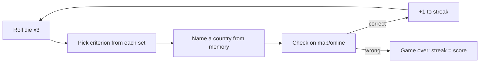

# Plan — Assignment 1: A Country-Naming Streak Game ("Roll Call")

Created: 2026-06-06

> Working title **"Roll Call"** (dice *roll* + the *roll call* of nations) — placeholder, change freely.
> This is a plan for *how to complete the assignment*, not the game itself. The game is the one-page printable PDF this plan produces.

---

## Summary

Build a one-player, paper-and-dice geography game whose goal is the longest possible **streak** of correctly named countries. Each round, three dice select one criterion from each of three criteria **sets**; the player must name a country meeting all three from memory, then check the answer on a map/online. This plan delivers: (1) a reusable **methodology** for designing the criteria, (2) an **exhaustive calibration** pass over all 216 dice combinations to hit the target difficulty spread, and (3) a **print-ready one-page PDF**. The 18 criteria themselves are drafted collaboratively in Phase 3 using the methodology from Phase 2.

---

## Assignment constraints (traceability)

Every constraint below must be satisfied by the final artifact:

- **Goal + difficulty by chance/skill** — Goal: maximize correct-answer streak. Chance: dice pick the criteria. Skill: geographic knowledge under a no-lookup rule.
- **Fits one sheet** — single letter/A4 page, printable.
- **One player** — solo streak game.
- **Description + instructions at the top** of the page.
- **Only extra item allowed: up to two six-sided dice** — we use dice (optional per the brief; random.org dice work as a substitute).
- **Title included.**
- **Legible when printed/scanned to PDF** for peer review.

---

## Locked decisions (from kickoff)

- **Production:** digital one-pager → export to PDF (not hand-drawn).
- **Criteria authoring:** Phase 2 produces the *methodology*; the actual 18 criteria are built together in Phase 3.
- **Difficulty validation:** **exhaustive** — compute the answer count for **all 216** dice combinations and tune until the spread is right.
- **Answer list stays off the page** — the player verifies on a map/online after committing an answer.

---

## Core game mechanic (to finalize in Phase 1)

- Three **sets** of criteria, each with criteria numbered **1–6**.
- A round = **roll a single die three times** (roll #1 → Set 1, roll #2 → Set 2, roll #3 → Set 3). This yields three independent 1–6 values using ≤2 dice as required. (Alt: roll two dice + reroll one to get a third value — pick the simpler instruction after a playtest.)
- Player names **one country** satisfying **all three** selected criteria, **from memory** — no map or search until the answer is committed.
- Correct → +1, continue. Wrong (or give up) → game over; the streak length is the score. Record your best.

---

## Phase 1 — Lock rules & one-pager skeleton

**Goal:** freeze the rules and the page structure so later phases have a fixed target.

- Finalize: scoring, win/lose condition, the no-lookup integrity rule, and the exact dice instruction (three rolls of one die vs. two-dice variant).
- Decide the **country universe** (see Key decisions) — required before any counting is meaningful.
- Sketch the page regions: Title → description → How to play → criteria grid (3 columns × 6 rows) → dice legend → scoring/integrity rules → streak tally box → footer (universe note + "verify on a map").

**Deliverable:** a one-page wireframe + final rules text.

---

## Phase 2 — Criteria-design methodology (the framework)

**Goal:** a repeatable method for choosing criteria, so Phase 3 is fast and Phase 4 converges.

**What makes a good criterion:**
1. **Objectively verifiable** — true/false for any country, checkable from a single map or reference. No fuzzy thresholds without a cited authority.
2. **Knowledge-recallable** — a player can reason about it from memory. That's the skill the game tests.
3. **Independent axis per set** — each set covers a *different type* of trait, so the three rolled criteria constrain on orthogonal dimensions (multiplicative narrowing, fewer contradictions, easier to tune).
4. **Non-empty & non-trivial** — never impossible (0 answers) and never so broad it fails to constrain.
5. **Mixed selectivity within a set** — include both broad and narrow criteria so different rolls produce different difficulties.

**Proposed three independent axes (one per set):**

| Set | Axis | Example trait types |
|-----|------|---------------------|
| **Set 1** | Name & spelling | starts with vowel; ends in "-a"/"-land"/"-stan"; ≤5 letters; ≥9 letters; contains a double letter; one word vs. multi-word; contains/omits a given letter |
| **Set 2** | Size, borders & shape | landlocked; island (no land borders); exactly one neighbor; 5+ neighbors; among 20 largest by area; microstate |
| **Set 3** | Location & physical features | in Africa / Europe / Asia; Southern Hemisphere; crossed by the equator; has Atlantic coast; has Pacific coast; peak above 2,000 m (or 4,000 m); entirely within the tropics |

**Selectivity estimate (quick pre-check before exhaustive verification):**
With ~193 countries and three roughly independent criteria of match-probabilities p₁,p₂,p₃, expected matches ≈ **193 · p₁·p₂·p₃**.
- Target ~5 answers → product ≈ 0.026 (e.g., 0.4 × 0.3 × 0.22).
- Target ~1 answer → product ≈ 0.005.
Classify each candidate by how many countries it matches — Broad (~60–120), Medium (~25–60), Narrow (~8–25), Rare (~1–8) — then pair across sets so the product lands in range. Hardest combos pair the narrowest from each set; easiest pair the broadest. Independence is only approximate (geographic traits correlate), which is exactly why Phase 4 verifies exhaustively.

**Deliverable:** the methodology above + a candidate criteria palette (more than 6 per set) to choose from in Phase 3.

---

## Phase 3 — Draft the 18 criteria (collaborative)

**Goal:** select exactly **6 criteria per set** (18 total) using the Phase 2 method.

- Work together to pick 6 per axis, deliberately spanning the selectivity tiers (a couple broad, a couple medium, a couple narrow/rare per set).
- For each criterion, record: exact wording for the page, the boolean test, and the **source** a player can check it against.
- Avoid obvious within-round contradictions (the exhaustive pass will catch the rest).

**Deliverable:** a draft 3×6 criteria grid with sources. **Depends on:** Phase 2.

---

## Phase 4 — Exhaustive difficulty calibration

**Goal:** guarantee the difficulty curve by checking **all 216** combinations.

1. **Pin the country universe** (decision below) so every count is well-defined.
2. **Build an attribute table** — one row per country, one column per boolean any criterion needs (name string, landlocked, island, neighbor count, area rank, continent, hemisphere, equator-crossing, ocean coasts, max-elevation band, …). Cite a source per column.
3. **Compute the 216 intersection counts** — for each (i, j, k) in 6×6×6, count countries satisfying criterion₁[i] ∧ criterion₂[j] ∧ criterion₃[k]. A spreadsheet or a tiny throwaway script does this; it is a **calibration aid, not part of the game**.
4. **Evaluate against targets:**
   - **Hard floor — no combo may equal 0.** Every round must be winnable; any 0 means swap/loosen a criterion.
   - **Easy ceiling** — cap the easy end (~6–8) so even easy rounds need thought.
   - **Shape** — roughly bell-ish, centered ~3, with a tail of "=1" hardest combos and ~5–6 at the easy end. Need not be a literal normal distribution.
5. **Iterate** — adjust criteria/thresholds and recompute until the histogram of the 216 counts matches the target.
6. **Produce an internal answer matrix** (which countries satisfy each combo) for the designer's own verification — **explicitly not printed** on the page.
7. **Lock the 18 criteria.**

**Deliverable:** verified 18 criteria + a histogram of the 216 counts + off-page answer matrix. **Depends on:** Phase 3.

---

## Phase 5 — Lay out & export the one-page PDF

**Goal:** a legible, print-ready single page.

- Draft in **print-styled HTML** (or clean Markdown) sized to letter/A4 portrait.
- Layout: Title → 2–3 sentence description → numbered "How to play" (≤6 steps) → **criteria grid** (3 columns Set 1/2/3 × rows 1–6) → dice→set legend → scoring/win + integrity rule → streak tally box → footer (universe note + "verify on a map or random.org-style source").
- **Answer matrix is not on the page** (requirement).
- Export to PDF; confirm it fits **one page** and is legible at print size.

**Deliverable:** the game PDF. **Depends on:** Phase 1 (skeleton) + Phase 4 (locked criteria).

---

## Phase 6 — Final review & submit

- Print/preview at 100% — legibility check for peer review (no clipped text, readable grid).
- One full solo playtest: roll, answer from memory, verify — confirm rounds feel winnable and the difficulty range is present.
- Confirm all assignment constraints (traceability list above) are met.
- Submit the PDF.

---

## Key decisions

- **Country universe:** propose the **193 UN member states** — pins counts and sidesteps observer/disputed-territory arguments. *Confirm in Phase 1.*
- **Dice usage:** one die rolled three times (≤2 dice constraint satisfied; simplest instruction). Revisit only if a playtest finds it clunky.
- **Set themes are fixed to independent axes** (name / borders-size / location-physical) — the main lever that makes difficulty tunable and contradictions rare.
- **Calibration is data-driven** — the 216-cell count table is the source of truth for difficulty, not intuition.

---

## Risks & gotchas

- **Impossible rounds (0 answers)** — most-likely failure; caught and removed by the Phase 4 exhaustive pass (e.g., "island" ∧ "5+ neighbors").
- **Ambiguous criteria/sources** — prefer traits checkable from one authoritative reference; print the reference so the player can verify.
- **Independence assumption is only approximate** — correlated geography skews counts; mitigated by exhaustive verification rather than the back-of-envelope estimate.
- **One-page fit & legibility** — the 3×6 grid plus rules is dense; iterate layout and do a real print test.
- **Player-verifiability** — every chosen criterion must be confirmable on a standard map/Wikipedia after answering.

---

## Open questions

- Final game **title** (working: "Roll Call").
- Confirm the **country universe** (proposed: UN 193).
- Include any **wildcard/themed** criteria, or keep all three axes strictly as above?
- **Mountain-elevation** thresholds and the source to cite (2,000 m? 4,000 m?).
