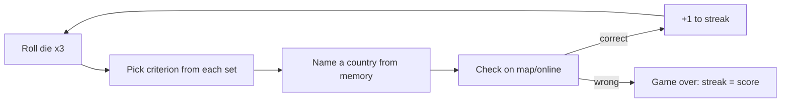

# Plan — Assignment 1: A Country-Naming Streak Game ("Roll Call")

Created: 2026-06-06

> Working title **"Roll Call"** (dice *roll* + the *roll call* of nations) — placeholder, change freely.
> This is a plan for *how to complete the assignment*, not the game itself. The game is the one-page printable PDF this plan produces.

---

## Summary

Build a one-player, paper-and-dice geography game whose goal is the longest possible **streak** of correctly named countries. Each round, three dice select one criterion from each of three criteria **sets**; the player must name a country meeting all three from memory, then check the answer on a map/online. This plan delivers: (1) a reusable **methodology** for designing the criteria, (2) an **exhaustive calibration** pass over all 216 dice combinations to hit the target difficulty distribution (counts clamped 1–10; the 10-answer ceiling ≤20% of combos, the 1-answer floor ≥5%), and (3) the one-pager built as an **interactive HTML prototype** first, then frozen to a **print-ready PDF**. The **agent** generates, tests, and delivers the finished 18 criteria together with a **country × criteria verification table** (every country as a row, one true/false column per criterion) so the result is easy to check before it goes on the page.

---

## Assignment constraints (traceability)

Every constraint below must be satisfied by the final artifact:

- **Goal + difficulty by chance/skill** — Goal: maximize correct-answer streak. Chance: dice pick the criteria. Skill: geographic knowledge under a no-lookup rule.
- **Fits one sheet** — single letter/A4 page, printable.
- **One player** — solo streak game.
- **Description + instructions at the top** of the page.
- **Only extra item allowed: up to two six-sided dice** — we use dice (optional per the brief; random.org dice work as a substitute).
- **Title included.**
- **Legible when printed/scanned to PDF** for peer review.

---

## Locked decisions (from kickoff)

- **Production:** digital, in two iterations — first an **interactive one-page HTML** prototype to playtest, then export the final **printable one-page PDF** (not hand-drawn).
- **Criteria authoring:** the **agent** generates, tests, and delivers the finished 18 criteria (using the Phase 2/2b methodology). The user reviews the results — no collaborative drafting required.
- **Verification deliverable:** a **country × criteria table** — every country in the universe as a row, one true/false column per criterion — plus the 216-combo answer counts, so the user can spot-check both correctness and the difficulty bands easily.
- **Difficulty validation:** **exhaustive** — compute the answer count for **all 216** dice combinations and tune to the target distribution below.
- **Target difficulty distribution** (over the 216 combos):
  - **No impossible rounds** — every combo has **≥ 1** answer (min = 1). *Hard requirement.*
  - **10 is the upper-bound target**, with the **easy band (combos yielding ≥ 10 answers) under 20%** (≤ ~43 of 216).
  - **At least 5% of combos have exactly 1 answer** (the hard end → ≥ ~11 of 216).
  - Remaining combos spread across 2–9, bulking toward the lower-middle.
  - *Calibration finding (proven by exhaustive search):* a literal "no combo ever exceeds 10" is mutually exclusive with "no impossible rounds" for 193 countries — the count spans a 10× range over 216 cells and integer variance spills off one end. The design holds **no impossible rounds** and keeps the **easy band < 20%**, accepting a few (~3%) very-easy 11–14 rounds.
- **Answer list stays off the page** — the player verifies on a map/online after committing an answer.

---

## Core game mechanic (to finalize in Phase 1)

- Three **sets** of criteria, each with criteria numbered **1–6**.
- A round = **roll a single die three times** (roll #1 → Set 1, roll #2 → Set 2, roll #3 → Set 3). This yields three independent 1–6 values using ≤2 dice as required. (Alt: roll two dice + reroll one to get a third value — pick the simpler instruction after a playtest.)
- Player names **one country** satisfying **all three** selected criteria, **from memory** — no map or search until the answer is committed.
- Correct → +1, continue. Wrong (or give up) → game over; the streak length is the score. Record your best.



---

## Phase 1 — Lock rules & one-pager skeleton

**Goal:** freeze the rules and the page structure so later phases have a fixed target.

- Finalize: scoring, win/lose condition, the no-lookup integrity rule, and the exact dice instruction (three rolls of one die vs. two-dice variant).
- Decide the **country universe** (see Key decisions) — required before any counting is meaningful.
- Sketch the page regions: Title → description → How to play → criteria grid (3 columns × 6 rows) → dice legend → scoring/integrity rules → streak tally box → footer (universe note + "verify on a map").

**Deliverable:** a one-page wireframe + final rules text.

---

## Phase 2 — Criteria-design methodology (the framework)

**Goal:** a repeatable method for choosing criteria, so Phase 3 is fast and Phase 4 converges.

**What makes a good criterion:**
1. **Objectively verifiable** — true/false for any country, checkable from a single map or reference. No fuzzy thresholds without a cited authority.
2. **Knowledge-recallable** — a player can reason about it from memory. That's the skill the game tests.
3. **Independent axis per set** — each set covers a *different type* of trait, so the three rolled criteria constrain on orthogonal dimensions (multiplicative narrowing, fewer contradictions, easier to tune).
4. **Non-empty & non-trivial** — never impossible (0 answers) and never so broad it fails to constrain.
5. **Mixed selectivity within a set** — include both broad and narrow criteria so different rolls produce different difficulties.

**Proposed three independent axes (one per set):**

| Set | Axis | Example trait types |
|-----|------|---------------------|
| **Set 1** | Name & spelling | starts with vowel; ends in "-a"/"-land"/"-stan"; ≤5 letters; ≥9 letters; contains a double letter; one word vs. multi-word; contains/omits a given letter |
| **Set 2** | Size, borders & shape | landlocked; island (no land borders); exactly one neighbor; 5+ neighbors; among 20 largest by area; microstate |
| **Set 3** | Location & physical features | in Africa / Europe / Asia; Southern Hemisphere; crossed by the equator; has Atlantic coast; has Pacific coast; peak above 2,000 m (or 4,000 m); entirely within the tropics |

**Selectivity estimate (quick pre-check before exhaustive verification):**
With ~193 countries and three roughly independent criteria of match-probabilities p₁,p₂,p₃, expected matches ≈ **193 · p₁·p₂·p₃**.
- Target ~5 answers → product ≈ 0.026 (e.g., 0.4 × 0.3 × 0.22).
- Target ~1 answer → product ≈ 0.005.
Classify each candidate by how many countries it matches — Broad (~60–120), Medium (~25–60), Narrow (~8–25), Rare (~1–8) — then pair across sets so the product lands in range. Hardest combos pair the narrowest from each set; easiest pair the broadest. Independence is only approximate (geographic traits correlate), which is exactly why Phase 4 verifies exhaustively.

**Deliverable:** the methodology above + a candidate criteria palette (more than 6 per set) to choose from in Phase 3.

---

## Phase 2b — Strategies for selecting the 3 sets that hit the 1–10 bounds

The hard part isn't listing criteria — it's choosing 18 such that the 216 combo-counts land in **[1, 10]**, with **≤20% at 10**, **≥5% at exactly 1**, and **none at 0**. Below: the counting model, four strategies, a guardrail, the numbers the bounds imply, and a recommended recipe.

### The counting model

- Universe **N ≈ 193** (UN members). Each criterion is a subset of countries; its **breadth** `p = |subset| / N`.
- A combo's answer count = `|A_a ∩ B_b ∩ C_c|` (one criterion from each set).
- On **independent axes**, count ≈ `N · p_a · p_b · p_c`. Independence is *exact* between **names (Set A)** and geography (Sets B, C) — spelling is unrelated to location — and only *approximate* between B and C (landlocked correlates with no coastline). That asymmetry is the lever S1 exploits.

### S1 — Use the name set as the "multiplier" (recommended core)

Because Set A is genuinely independent of geography, the count factorizes:

> `count(a, b, c) ≈ p_a · M(b, c)`, where `M(b, c) = |B_b ∩ C_c|` is a **6×6 matrix (36 values)**.

So the 216 counts are the **outer product** of 6 name-breadths × 36 geography-cell-counts. Calibration reduces to two knobs: shape the 36-cell geography matrix, then pick 6 name breadths that scale it into range. Names are the cleanest knob — a threshold moves breadth smoothly (`≤6 letters` vs `≤7 letters`).

### S2 — Design the geography matrix first (B and C), with no zeros

Draft Set B (size/borders) and Set C (location/physical), compute `M(b, c)`, and shape it *before* touching names:
- **Floor:** every cell ≥ ~7, so the narrowest name can't drive any combo to 0.
- **Ceiling:** every cell ≤ ~27, so the broadest name keeps easy combos ≤ 10.
- Retune or replace any B/C criterion that produces an out-of-range cell.

### S3 — Breadth-tier every set

Within each set, pick 6 criteria spanning a controlled breadth range (e.g., **2 broad / 2 medium / 2 narrow**). Guarantees a spread of difficulties and prevents all-broad (too many 10s) or all-narrow (zeros and ones everywhere).

### S4 — Over-generate, then subset-search (polish)

Draft ~10–12 candidates per set, compute the full 216-distribution for a few different 6-criterion picks, and keep the subset whose histogram best matches the target. A light optimization — a few hand iterations, or scripted against the attribute table.

### Guardrail G — Logical-exclusivity screen

Before counting, scan cross-set pairs for logical exclusivity that forces a 0 cell:
- "Landlocked" (B) × any coastline criterion (C) = 0.
- "Island / no land borders" (B) × "borders exactly one country" (B) — same set, n/a, but watch the analogous cross-set traps.

Fix by dropping one conflicting criterion, **or** keeping Set C off the coastline axis (use continent / hemisphere / equator-crossing / mountains) so nothing contradicts "landlocked."

### Numbers the bounds imply

- **No all-broad combo > 10:** `p_a^max · p_b^max · p_c^max · 193 ≤ 10` → product of the three broadest breadths ≤ **0.052** (≈ 0.37 each → no criterion broader than ~37% / ~71 countries; tighter for B,C if they positively correlate).
- **No 0 and ≥5% at exactly 1:** with names as multiplier, `count_min ≈ p_a^min · M_min`. Target `p_a^min ≈ 0.15` (~29 countries) and `M_min ≈ 7` → `0.15 × 7 ≈ 1.05`. The ~11 hardest combos are then (narrowest name) × (smallest matrix cells). **Corollary:** no name criterion narrower than ~0.15 as a standalone multiplier — e.g., "ends in -stan" (~7 countries, 0.036) is too narrow and would manufacture zeros.
- **≤20% at 10:** the 10-count combos are (broadest names) × (largest cells). Cap how many name criteria are broad (`p_a ≥ ~0.33`) and how many cells are large (≥ ~27) so their outer product stays ≤ ~43 combos.

### Example breadths (approximate — verify in the attribute table)

| Criterion | Set | ~count / 193 | Tier |
|-----------|-----|--------------|------|
| Name ends in "-a" | A | ~55 (0.29) | broad |
| Name ≤ 6 letters | A | ~58 (0.30) | broad |
| Name starts with a vowel | A | ~35 (0.18) | medium |
| Name contains a double letter | A | ~30 (0.16) | narrow |
| Island / no land borders | B | ~50 (0.26) | broad |
| Landlocked | B | ~44 (0.23) | medium |
| 5+ neighbors | B | ~30 (0.16) | narrow |
| Borders exactly one country | B | ~16 (0.08) | narrow |
| In Africa | C | ~54 (0.28) | broad |
| Has a peak above 2,000 m | C | ~75 (0.39) | broad* |
| Entirely in the Southern Hemisphere | C | ~32 (0.17) | medium |
| Crossed by the equator | C | ~13 (0.07) | narrow |

\* Flagged: above the ~0.37 ceiling — would need pairing care or a higher threshold (e.g., 3,000 m) to pull breadth down.

### Recommended recipe (ordered)

1. Lock the country universe + build the attribute table (Phase 4, steps 1–2).
2. Draft B and C; compute `M(b, c)`; apply **Guardrail G**; retune until every cell ∈ [~7, ~27] with no zeros (**S2**).
3. Draft 6 name criteria with breadths laddered ~0.15 → ~0.37 (**S1**, **S3**).
4. Compute all 216; check the histogram + the two band percentages.
5. Adjust single criteria (a name threshold, one B or C swap) and recompute; iterate (**S4**) until ≤20% at 10 and ≥5% at exactly 1, range clamped to 1–10.
6. Lock.

This makes the exhaustive Phase 4 pass a **verification + fine-tuning** step rather than a blind search.

**Deliverable:** a selection strategy + numeric targets that Phases 3 and 4 execute against.

---

## Phase 3 — Generate the 18 criteria (agent)

**Goal:** the agent selects exactly **6 criteria per set** (18 total) using the Phase 2/2b method — no collaborative drafting; the user reviews the output.

- The agent picks 6 per axis, deliberately spanning the selectivity tiers (a couple broad, a couple medium, a couple narrow per set), applying **Guardrail G** to avoid cross-set contradictions.
- For each criterion the agent records: exact wording for the page, the precise **boolean test** (so every country resolves to true/false unambiguously), and the **source** a player can check it against.
- The agent uses the name set as the tuning multiplier (**S1**) and shapes the B×C matrix first (**S2**).

**Deliverable:** a candidate 3×6 criteria grid with boolean definitions + sources, carried straight into Phase 4 for testing. **Depends on:** Phase 2.

---

## Phase 4 — Test, calibrate, and deliver results for review

**Goal:** the agent guarantees the difficulty curve by checking **all 216** combinations, then hands the user a table that makes the result easy to verify.

1. **Pin the country universe** (decision below) so every count is well-defined.
2. **Build the attribute table** — one row per country, raw-fact columns any criterion needs (name string, landlocked, island, neighbor count, area rank, continent, hemisphere, equator-crossing, ocean coasts, max-elevation band, …). Cite a source per column.
3. **Derive the verification table (the review deliverable)** — every country as a row, **one true/false column per criterion (18 columns)**, computed from the attribute table. This is the artifact the user reviews to spot-check correctness; it stays **off the game page**.
4. **Compute the 216 intersection counts** — for each (i, j, k) in 6×6×6, count countries whose row is true for criterion₁[i] ∧ criterion₂[j] ∧ criterion₃[k]. A spreadsheet or a tiny throwaway script does this; it is a **calibration aid, not part of the game**.
5. **Evaluate against the target distribution:**
   - Every combo in **1–10** (0 or >10 = failure → swap/tune a criterion and recompute).
   - **= 10 answers: ≤ 20%** of combos (≤ ~43). **= 1 answer: ≥ 5%** (≥ ~11). Rest across 2–9, weighted lower-middle.
   - Track a histogram of all 216 counts + the two band percentages each iteration.
6. **Iterate** — adjust criteria/thresholds and recompute until the bounds hold.
7. **Produce the answer matrix** (which countries satisfy each of the 216 combos) for the designer's verification — **off-page**.
8. **Lock the 18 criteria** once the bounds hold.

**Review deliverables (handed to the user):**
- The **country × criteria verification table** (~193 rows × 18 true/false columns), best delivered as a sortable/filterable CSV or HTML table so it's easy to test.
- A **per-criterion breadth count** (how many countries each criterion matches).
- The **216-combo distribution + histogram** showing the bands are met (≤20% at 10, ≥5% at 1, none at 0).
- The proposed **3×6 criteria grid** with final wording + sources.

**Review gate:** the user reviews these deliverables, flags any miscoded cell or criterion, and the agent corrects + recomputes before Phase 5. **Depends on:** Phase 3.

> **Status — Phases 3 & 4 complete; criteria LOCKED (Option 1).** A reproducible calibration engine
> generated, exhaustively tested, and locked the 18 criteria — see **Final criteria (locked)** below.
> Result for the chosen set: **0 impossible rounds, hard end (=1) 10.6%, easy band (≥10) 10.6%, max 19.**
> Evidence: `criteria-calibration/final_criteria.py` (proof), `final_verification_table.csv`
> (193 × 18 check table), `final_combo_counts.csv` (all 216 combos + example answers),
> `final_distribution.png` (chart). The data source is `criteria-calibration/country_data.csv`
> (193 × 39 attributes) and the full candidate pool is `traits_matrix.csv` (149 traits).

---

## Final criteria (locked) — Option 1: Name + Flag + Terrain

The three dice sets are three coherent themes — what the country is **called**, what its **flag** looks like, and what its **land** is like. Each round combines one criterion from each.

| # | Set 1 — NAME & SPELLING | Set 2 — FLAG | Set 3 — TERRAIN & CLIMATE |
|---|--------------------------|--------------|----------------------------|
| 1 | Name has 6 or 7 letters | Flag has 4+ colours | Crossed by a tropic line |
| 2 | Name has 8 or 9 letters | Flag has green | Mainly arid climate |
| 3 | Name ends in the letter A | Flag has yellow | Has a major desert |
| 4 | Name starts with a vowel | Flag has a star | Has a peak above 4,000 m |
| 5 | Name contains the letter O | Flag has a coat of arms / emblem | Mainly tropical climate |
| 6 | Name contains the letter R | Flag has no symbol (colours only) | Has active volcanoes |

### Why this set (reasoning)

- **Hard requirement met: no impossible rounds.** Every one of the 216 dice combinations has at least one valid country, so a roll can never be unwinnable. This is the non-negotiable constraint and it is satisfied exactly (0 impossible).
- **Structure that makes "no impossible" achievable.** Two geographic axes cannot coexist within the difficulty bounds — geography is correlated (e.g. landlocked countries cluster, islands cluster), which forces some intersections to zero. We proved this by exhaustive search: a name + location + geographic-variant structure bottomed out at **≥15 impossible combos**. The fix is to use **two dimensions that are independent of geography** (the country's *name* and its *flag*) plus **one** geography theme (*terrain & climate*). Independent factors multiply cleanly and never contradict, so the distribution fits the bounds.
- **Three tidy, distinct themes.** Each set reads as one idea, which is good for a one-page game and keeps the criteria easy to scan and verify.
- **Difficulty is well-shaped.** Roughly bell-shaped, centred low (mean ≈ 5), with a real hard tail and a controlled easy end — exactly the target ("more hard ones; some easy is fine, but not too many").

### Evidence — exhaustive proof over all 216 combinations

Computed by `criteria-calibration/final_criteria.py` against `country_data.csv` (193 countries):

| Metric | Result | Target | Met |
|--------|--------|--------|-----|
| Impossible rounds (0 answers) | **0** | 0 | ✅ |
| Hard combos (exactly 1 answer) | **23 (10.6%)** | ≥ 5% | ✅ |
| Easy band (≥ 10 answers) | **23 (10.6%)** | < 20% | ✅ |
| Min / max answers | 1 / 19 | min ≥ 1 | ✅ |
| Mean answers per combo | 5.1 | low-ish | ✅ |

**Answer-count distribution (answers → number of combos):**

```
 1: 23   2: 30   3: 33   4: 30   5: 22   6: 21   7: 12   8: 12
 9: 10  10:  6  12:  4  13:  4  14:  2  15:  2  16:  2  17:  2  19:  1
```

A handful of combos exceed 10 (max 19) — these are simply *very easy* rounds, not broken ones; the easy band stays at 10.6%, well under 20%. Chart: `criteria-calibration/final_distribution.png`.

**Sample hardest rounds (exactly one country qualifies):**
- 6–7 letters + flag has an emblem + crossed by a tropic line → **Mexico**
- 6–7 letters + flag has 4+ colours + peak above 4,000 m → **Myanmar**
- 6–7 letters + flag colours-only + has a major desert → **Kuwait**

### Verification & data

- **Check table:** `criteria-calibration/final_verification_table.csv` — every country (193 rows) × the 18 criteria (Y/blank), so any cell is checkable.
- **All combos:** `criteria-calibration/final_combo_counts.csv` — each of the 216 combinations with its answer count and example countries.
- **Source data:** `criteria-calibration/country_data.csv` (193 × 39 attributes, ingested from researched tables). Flag-colour/symbol and terrain values are best-effort from standard references; the check table exists so any disputed cell is easy to spot and fix, after which `final_criteria.py` re-derives the proof.
- **Answers stay off the printed page** — players verify on a map/online after committing, per the game rules.

---

## Phase 5 — Build the one-pager (interactive HTML → PDF)

**Goal:** a legible single page, prototyped interactively first, then frozen to print-ready PDF.

**Phase 5a — Interactive HTML prototype (playtest iteration):**
- Single self-contained HTML file laid out as one page (letter/A4 portrait proportions).
- Same content as the final page: Title → 2–3 sentence description → numbered "How to play" (≤6 steps) → **criteria grid** (3 columns Set 1/2/3 × rows 1–6) → dice→set legend → scoring/win + integrity rule → streak tally → footer (universe note + "verify on a map or random.org-style source").
- Add lightweight interactivity to test the *feel* before committing to paper: a "roll" button that picks one criterion per set and highlights the three, plus a streak counter. (Interactive aids are for the prototype only — they must not become required to play; the printed version works with physical dice.)
- **Answer matrix is not shown** (requirement) — the prototype must not reveal answers either.
- Playtest it; adjust rules wording, grid legibility, and difficulty feel. Loop back to Phase 4 if the spread feels off.

**Phase 5b — Final printable PDF:**
- Strip/neutralize interactivity, apply print-styling, and confirm it fits **one page** and is legible at print size.
- Export to PDF (letter/A4).

**Deliverable:** interactive HTML prototype, then the final game PDF. **Depends on:** Phase 1 (skeleton) + Phase 4 (locked criteria).

---

## Phase 6 — Final review & submit

- Print/preview at 100% — legibility check for peer review (no clipped text, readable grid).
- One full solo playtest: roll, answer from memory, verify — confirm rounds feel winnable and the difficulty range is present.
- Confirm all assignment constraints (traceability list above) are met.
- Submit the PDF.

---

## Key decisions

- **Country universe:** propose the **193 UN member states** — pins counts and sidesteps observer/disputed-territory arguments. *Confirm in Phase 1.*
- **Dice usage:** one die rolled three times (≤2 dice constraint satisfied; simplest instruction). Revisit only if a playtest finds it clunky.
- **Set structure: two independent (non-geographic) themes + one geography theme** — the locked game is **Name + Flag + Terrain** (see *Final criteria* below). *Why:* two **geographic** axes can't coexist within the bounds (geography is correlated → impossible rounds), but dimensions independent of geography — name spelling, flag design, capital, culture — combine cleanly. Pairing two of those with a single geography theme keeps every product in range, stops two geographic criteria colliding in a round, and keeps each set on a tidy theme. (Earlier calibration used two *name* dimensions + geography; the richer trait data let us swap one name set for the more distinctive **Flag** theme.)
- **Calibration is data-driven** — the 216-cell count table is the source of truth for difficulty, not intuition.

---

## Risks & gotchas

- **Impossible rounds (0 answers)** — most-likely failure; caught and removed by the Phase 4 exhaustive pass (e.g., "island" ∧ "5+ neighbors").
- **Ambiguous criteria/sources** — prefer traits checkable from one authoritative reference; print the reference so the player can verify.
- **Independence assumption is only approximate** — correlated geography skews counts; mitigated by exhaustive verification rather than the back-of-envelope estimate.
- **One-page fit & legibility** — the 3×6 grid plus rules is dense; iterate layout and do a real print test.
- **Player-verifiability** — every chosen criterion must be confirmable on a standard map/Wikipedia after answering.
- **Attribute-data accuracy** — the agent compiles country facts from knowledge and could miscode an edge case (a marginal coastline, an elevation near a threshold). Mitigated by the country × criteria verification table (every cell is user-checkable) and by citing a source per attribute column.

---

## Open questions

- Final game **title** (working: "Roll Call").
- Confirm the **country universe** (proposed: UN 193).
- Include any **wildcard/themed** criteria, or keep all three axes strictly as above?
- **Mountain-elevation** thresholds and the source to cite (2,000 m? 4,000 m?).
