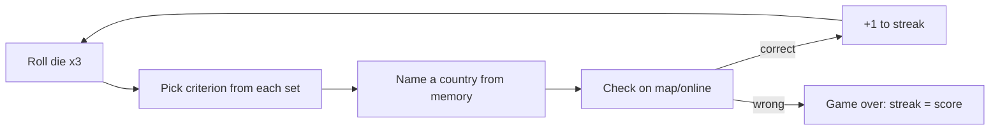

# Plan — Assignment 1: A Country-Naming Streak Game ("Roll Call")

Created: 2026-06-06

> Working title **"Roll Call"** (dice *roll* + the *roll call* of nations) — placeholder, change freely.
> This is a plan for *how to complete the assignment*, not the game itself. The game is the one-page printable PDF this plan produces.

---

## Summary

Build a one-player, paper-and-dice geography game whose goal is the longest possible **streak** of correctly named countries. Each round, three dice select one criterion from each of three criteria **sets**; the player must name a country meeting all three from memory, then check the answer on a map/online. This plan delivers: (1) a reusable **methodology** for designing the criteria, (2) an **exhaustive calibration** pass over all 216 dice combinations to hit the target difficulty distribution (counts clamped 1–10; the 10-answer ceiling ≤20% of combos, the 1-answer floor ≥5%), and (3) the one-pager built as an **interactive HTML prototype** first, then frozen to a **print-ready PDF**. The 18 criteria themselves are drafted collaboratively in Phase 3 using the methodology from Phase 2.

---

## Assignment constraints (traceability)

Every constraint below must be satisfied by the final artifact:

- **Goal + difficulty by chance/skill** — Goal: maximize correct-answer streak. Chance: dice pick the criteria. Skill: geographic knowledge under a no-lookup rule.
- **Fits one sheet** — single letter/A4 page, printable.
- **One player** — solo streak game.
- **Description + instructions at the top** of the page.
- **Only extra item allowed: up to two six-sided dice** — we use dice (optional per the brief; random.org dice work as a substitute).
- **Title included.**
- **Legible when printed/scanned to PDF** for peer review.

---

## Locked decisions (from kickoff)

- **Production:** digital, in two iterations — first an **interactive one-page HTML** prototype to playtest, then export the final **printable one-page PDF** (not hand-drawn).
- **Criteria authoring:** Phase 2 produces the *methodology*; the actual 18 criteria are built together in Phase 3.
- **Difficulty validation:** **exhaustive** — compute the answer count for **all 216** dice combinations and tune to the target distribution below.
- **Target difficulty distribution** (over the 216 combos):
  - **Min = 1, max = 10** — every combo must land in the **1–10** range (0 = impossible round; >10 = too easy).
  - **= 10 answers: no more than 20% of combos** (the easy ceiling → at most ~43 of 216).
  - **= 1 answer: at least 5% of combos** (the hard floor → at least ~11 of 216).
  - Remaining combos spread across 2–9, bulking toward the lower-middle to keep the game challenging.
- **Answer list stays off the page** — the player verifies on a map/online after committing an answer.

---

## Core game mechanic (to finalize in Phase 1)

- Three **sets** of criteria, each with criteria numbered **1–6**.
- A round = **roll a single die three times** (roll #1 → Set 1, roll #2 → Set 2, roll #3 → Set 3). This yields three independent 1–6 values using ≤2 dice as required. (Alt: roll two dice + reroll one to get a third value — pick the simpler instruction after a playtest.)
- Player names **one country** satisfying **all three** selected criteria, **from memory** — no map or search until the answer is committed.
- Correct → +1, continue. Wrong (or give up) → game over; the streak length is the score. Record your best.

---

## Phase 1 — Lock rules & one-pager skeleton

**Goal:** freeze the rules and the page structure so later phases have a fixed target.

- Finalize: scoring, win/lose condition, the no-lookup integrity rule, and the exact dice instruction (three rolls of one die vs. two-dice variant).
- Decide the **country universe** (see Key decisions) — required before any counting is meaningful.
- Sketch the page regions: Title → description → How to play → criteria grid (3 columns × 6 rows) → dice legend → scoring/integrity rules → streak tally box → footer (universe note + "verify on a map").

**Deliverable:** a one-page wireframe + final rules text.

---

## Phase 2 — Criteria-design methodology (the framework)

**Goal:** a repeatable method for choosing criteria, so Phase 3 is fast and Phase 4 converges.

**What makes a good criterion:**
1. **Objectively verifiable** — true/false for any country, checkable from a single map or reference. No fuzzy thresholds without a cited authority.
2. **Knowledge-recallable** — a player can reason about it from memory. That's the skill the game tests.
3. **Independent axis per set** — each set covers a *different type* of trait, so the three rolled criteria constrain on orthogonal dimensions (multiplicative narrowing, fewer contradictions, easier to tune).
4. **Non-empty & non-trivial** — never impossible (0 answers) and never so broad it fails to constrain.
5. **Mixed selectivity within a set** — include both broad and narrow criteria so different rolls produce different difficulties.

**Proposed three independent axes (one per set):**

| Set | Axis | Example trait types |
|-----|------|---------------------|
| **Set 1** | Name & spelling | starts with vowel; ends in "-a"/"-land"/"-stan"; ≤5 letters; ≥9 letters; contains a double letter; one word vs. multi-word; contains/omits a given letter |
| **Set 2** | Size, borders & shape | landlocked; island (no land borders); exactly one neighbor; 5+ neighbors; among 20 largest by area; microstate |
| **Set 3** | Location & physical features | in Africa / Europe / Asia; Southern Hemisphere; crossed by the equator; has Atlantic coast; has Pacific coast; peak above 2,000 m (or 4,000 m); entirely within the tropics |

**Selectivity estimate (quick pre-check before exhaustive verification):**
With ~193 countries and three roughly independent criteria of match-probabilities p₁,p₂,p₃, expected matches ≈ **193 · p₁·p₂·p₃**.
- Target ~5 answers → product ≈ 0.026 (e.g., 0.4 × 0.3 × 0.22).
- Target ~1 answer → product ≈ 0.005.
Classify each candidate by how many countries it matches — Broad (~60–120), Medium (~25–60), Narrow (~8–25), Rare (~1–8) — then pair across sets so the product lands in range. Hardest combos pair the narrowest from each set; easiest pair the broadest. Independence is only approximate (geographic traits correlate), which is exactly why Phase 4 verifies exhaustively.

**Deliverable:** the methodology above + a candidate criteria palette (more than 6 per set) to choose from in Phase 3.

---

## Phase 2b — Strategies for selecting the 3 sets that hit the 1–10 bounds

The hard part isn't listing criteria — it's choosing 18 such that the 216 combo-counts land in **[1, 10]**, with **≤20% at 10**, **≥5% at exactly 1**, and **none at 0**. Below: the counting model, four strategies, a guardrail, the numbers the bounds imply, and a recommended recipe.

### The counting model

- Universe **N ≈ 193** (UN members). Each criterion is a subset of countries; its **breadth** `p = |subset| / N`.
- A combo's answer count = `|A_a ∩ B_b ∩ C_c|` (one criterion from each set).
- On **independent axes**, count ≈ `N · p_a · p_b · p_c`. Independence is *exact* between **names (Set A)** and geography (Sets B, C) — spelling is unrelated to location — and only *approximate* between B and C (landlocked correlates with no coastline). That asymmetry is the lever S1 exploits.

### S1 — Use the name set as the "multiplier" (recommended core)

Because Set A is genuinely independent of geography, the count factorizes:

> `count(a, b, c) ≈ p_a · M(b, c)`, where `M(b, c) = |B_b ∩ C_c|` is a **6×6 matrix (36 values)**.

So the 216 counts are the **outer product** of 6 name-breadths × 36 geography-cell-counts. Calibration reduces to two knobs: shape the 36-cell geography matrix, then pick 6 name breadths that scale it into range. Names are the cleanest knob — a threshold moves breadth smoothly (`≤6 letters` vs `≤7 letters`).

### S2 — Design the geography matrix first (B and C), with no zeros

Draft Set B (size/borders) and Set C (location/physical), compute `M(b, c)`, and shape it *before* touching names:
- **Floor:** every cell ≥ ~7, so the narrowest name can't drive any combo to 0.
- **Ceiling:** every cell ≤ ~27, so the broadest name keeps easy combos ≤ 10.
- Retune or replace any B/C criterion that produces an out-of-range cell.

### S3 — Breadth-tier every set

Within each set, pick 6 criteria spanning a controlled breadth range (e.g., **2 broad / 2 medium / 2 narrow**). Guarantees a spread of difficulties and prevents all-broad (too many 10s) or all-narrow (zeros and ones everywhere).

### S4 — Over-generate, then subset-search (polish)

Draft ~10–12 candidates per set, compute the full 216-distribution for a few different 6-criterion picks, and keep the subset whose histogram best matches the target. A light optimization — a few hand iterations, or scripted against the attribute table.

### Guardrail G — Logical-exclusivity screen

Before counting, scan cross-set pairs for logical exclusivity that forces a 0 cell:
- "Landlocked" (B) × any coastline criterion (C) = 0.
- "Island / no land borders" (B) × "borders exactly one country" (B) — same set, n/a, but watch the analogous cross-set traps.

Fix by dropping one conflicting criterion, **or** keeping Set C off the coastline axis (use continent / hemisphere / equator-crossing / mountains) so nothing contradicts "landlocked."

### Numbers the bounds imply

- **No all-broad combo > 10:** `p_a^max · p_b^max · p_c^max · 193 ≤ 10` → product of the three broadest breadths ≤ **0.052** (≈ 0.37 each → no criterion broader than ~37% / ~71 countries; tighter for B,C if they positively correlate).
- **No 0 and ≥5% at exactly 1:** with names as multiplier, `count_min ≈ p_a^min · M_min`. Target `p_a^min ≈ 0.15` (~29 countries) and `M_min ≈ 7` → `0.15 × 7 ≈ 1.05`. The ~11 hardest combos are then (narrowest name) × (smallest matrix cells). **Corollary:** no name criterion narrower than ~0.15 as a standalone multiplier — e.g., "ends in -stan" (~7 countries, 0.036) is too narrow and would manufacture zeros.
- **≤20% at 10:** the 10-count combos are (broadest names) × (largest cells). Cap how many name criteria are broad (`p_a ≥ ~0.33`) and how many cells are large (≥ ~27) so their outer product stays ≤ ~43 combos.

### Example breadths (approximate — verify in the attribute table)

| Criterion | Set | ~count / 193 | Tier |
|-----------|-----|--------------|------|
| Name ends in "-a" | A | ~55 (0.29) | broad |
| Name ≤ 6 letters | A | ~58 (0.30) | broad |
| Name starts with a vowel | A | ~35 (0.18) | medium |
| Name contains a double letter | A | ~30 (0.16) | narrow |
| Island / no land borders | B | ~50 (0.26) | broad |
| Landlocked | B | ~44 (0.23) | medium |
| 5+ neighbors | B | ~30 (0.16) | narrow |
| Borders exactly one country | B | ~16 (0.08) | narrow |
| In Africa | C | ~54 (0.28) | broad |
| Has a peak above 2,000 m | C | ~75 (0.39) | broad* |
| Entirely in the Southern Hemisphere | C | ~32 (0.17) | medium |
| Crossed by the equator | C | ~13 (0.07) | narrow |

\* Flagged: above the ~0.37 ceiling — would need pairing care or a higher threshold (e.g., 3,000 m) to pull breadth down.

### Recommended recipe (ordered)

1. Lock the country universe + build the attribute table (Phase 4, steps 1–2).
2. Draft B and C; compute `M(b, c)`; apply **Guardrail G**; retune until every cell ∈ [~7, ~27] with no zeros (**S2**).
3. Draft 6 name criteria with breadths laddered ~0.15 → ~0.37 (**S1**, **S3**).
4. Compute all 216; check the histogram + the two band percentages.
5. Adjust single criteria (a name threshold, one B or C swap) and recompute; iterate (**S4**) until ≤20% at 10 and ≥5% at exactly 1, range clamped to 1–10.
6. Lock.

This makes the exhaustive Phase 4 pass a **verification + fine-tuning** step rather than a blind search.

**Deliverable:** a selection strategy + numeric targets that Phases 3 and 4 execute against.

---

## Phase 3 — Draft the 18 criteria (collaborative)

**Goal:** select exactly **6 criteria per set** (18 total) using the Phase 2 method.

- Work together to pick 6 per axis, deliberately spanning the selectivity tiers (a couple broad, a couple medium, a couple narrow/rare per set).
- For each criterion, record: exact wording for the page, the boolean test, and the **source** a player can check it against.
- Avoid obvious within-round contradictions (the exhaustive pass will catch the rest).

**Deliverable:** a draft 3×6 criteria grid with sources. **Depends on:** Phase 2.

---

## Phase 4 — Exhaustive difficulty calibration

**Goal:** guarantee the difficulty curve by checking **all 216** combinations.

1. **Pin the country universe** (decision below) so every count is well-defined.
2. **Build an attribute table** — one row per country, one column per boolean any criterion needs (name string, landlocked, island, neighbor count, area rank, continent, hemisphere, equator-crossing, ocean coasts, max-elevation band, …). Cite a source per column.
3. **Compute the 216 intersection counts** — for each (i, j, k) in 6×6×6, count countries satisfying criterion₁[i] ∧ criterion₂[j] ∧ criterion₃[k]. A spreadsheet or a tiny throwaway script does this; it is a **calibration aid, not part of the game**.
4. **Evaluate against the target distribution:**
   - **Every combo must land in 1–10.** Any combo = 0 (impossible round) or > 10 (too easy) is a failure → swap/tighten/loosen a criterion and recompute.
   - **= 10 answers: ≤ 20% of the 216 combos** (easy ceiling; at most ~43).
   - **= 1 answer: ≥ 5% of the 216 combos** (hard floor; at least ~11).
   - The rest spread across 2–9, bulking toward the lower-middle so the game stays challenging.
   - Track a histogram of all 216 counts plus the two band percentages each iteration; tune until both bounds hold and the range stays clamped to 1–10.
5. **Iterate** — adjust criteria/thresholds and recompute until the histogram of the 216 counts matches the target.
6. **Produce an internal answer matrix** (which countries satisfy each combo) for the designer's own verification — **explicitly not printed** on the page.
7. **Lock the 18 criteria.**

**Deliverable:** verified 18 criteria + a histogram of the 216 counts + off-page answer matrix. **Depends on:** Phase 3.

---

## Phase 5 — Build the one-pager (interactive HTML → PDF)

**Goal:** a legible single page, prototyped interactively first, then frozen to print-ready PDF.

**Phase 5a — Interactive HTML prototype (playtest iteration):**
- Single self-contained HTML file laid out as one page (letter/A4 portrait proportions).
- Same content as the final page: Title → 2–3 sentence description → numbered "How to play" (≤6 steps) → **criteria grid** (3 columns Set 1/2/3 × rows 1–6) → dice→set legend → scoring/win + integrity rule → streak tally → footer (universe note + "verify on a map or random.org-style source").
- Add lightweight interactivity to test the *feel* before committing to paper: a "roll" button that picks one criterion per set and highlights the three, plus a streak counter. (Interactive aids are for the prototype only — they must not become required to play; the printed version works with physical dice.)
- **Answer matrix is not shown** (requirement) — the prototype must not reveal answers either.
- Playtest it; adjust rules wording, grid legibility, and difficulty feel. Loop back to Phase 4 if the spread feels off.

**Phase 5b — Final printable PDF:**
- Strip/neutralize interactivity, apply print-styling, and confirm it fits **one page** and is legible at print size.
- Export to PDF (letter/A4).

**Deliverable:** interactive HTML prototype, then the final game PDF. **Depends on:** Phase 1 (skeleton) + Phase 4 (locked criteria).

---

## Phase 6 — Final review & submit

- Print/preview at 100% — legibility check for peer review (no clipped text, readable grid).
- One full solo playtest: roll, answer from memory, verify — confirm rounds feel winnable and the difficulty range is present.
- Confirm all assignment constraints (traceability list above) are met.
- Submit the PDF.

---

## Key decisions

- **Country universe:** propose the **193 UN member states** — pins counts and sidesteps observer/disputed-territory arguments. *Confirm in Phase 1.*
- **Dice usage:** one die rolled three times (≤2 dice constraint satisfied; simplest instruction). Revisit only if a playtest finds it clunky.
- **Set themes are fixed to independent axes** (name / borders-size / location-physical) — the main lever that makes difficulty tunable and contradictions rare.
- **Calibration is data-driven** — the 216-cell count table is the source of truth for difficulty, not intuition.

---

## Risks & gotchas

- **Impossible rounds (0 answers)** — most-likely failure; caught and removed by the Phase 4 exhaustive pass (e.g., "island" ∧ "5+ neighbors").
- **Ambiguous criteria/sources** — prefer traits checkable from one authoritative reference; print the reference so the player can verify.
- **Independence assumption is only approximate** — correlated geography skews counts; mitigated by exhaustive verification rather than the back-of-envelope estimate.
- **One-page fit & legibility** — the 3×6 grid plus rules is dense; iterate layout and do a real print test.
- **Player-verifiability** — every chosen criterion must be confirmable on a standard map/Wikipedia after answering.

---

## Open questions

- Final game **title** (working: "Roll Call").
- Confirm the **country universe** (proposed: UN 193).
- Include any **wildcard/themed** criteria, or keep all three axes strictly as above?
- **Mountain-elevation** thresholds and the source to cite (2,000 m? 4,000 m?).
